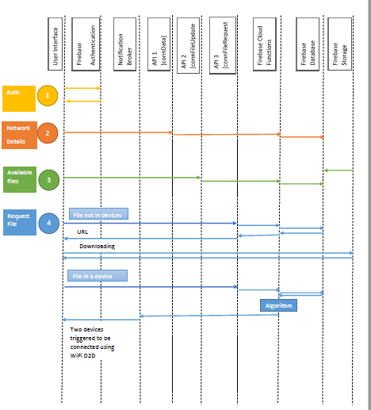
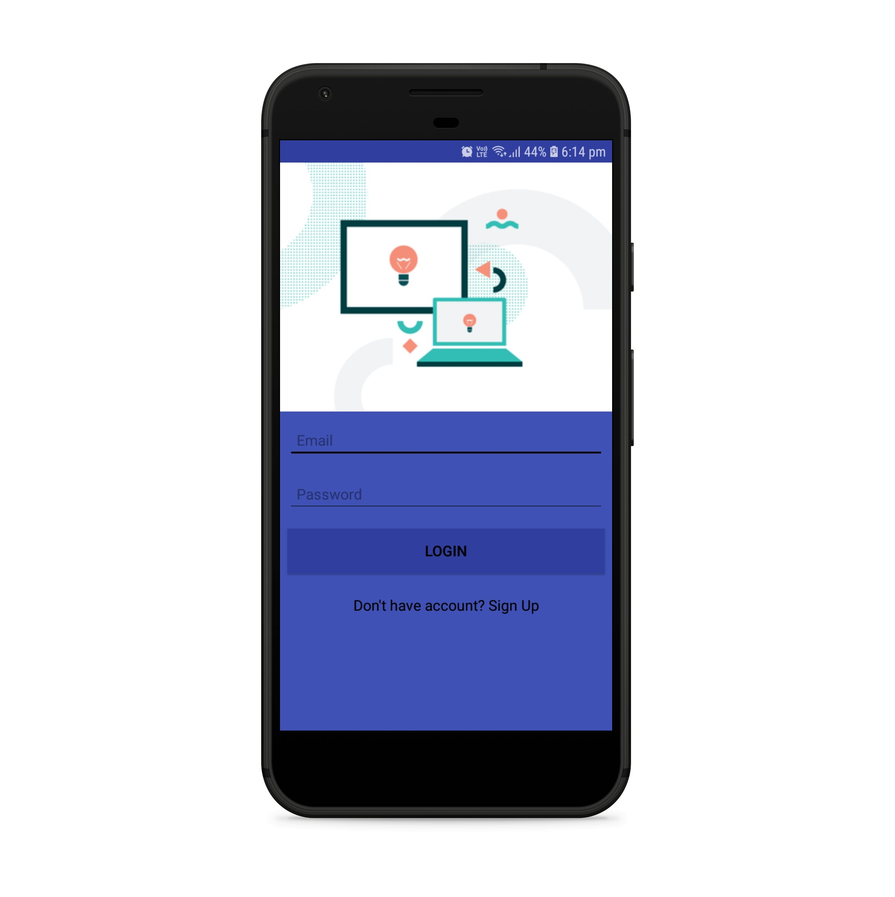
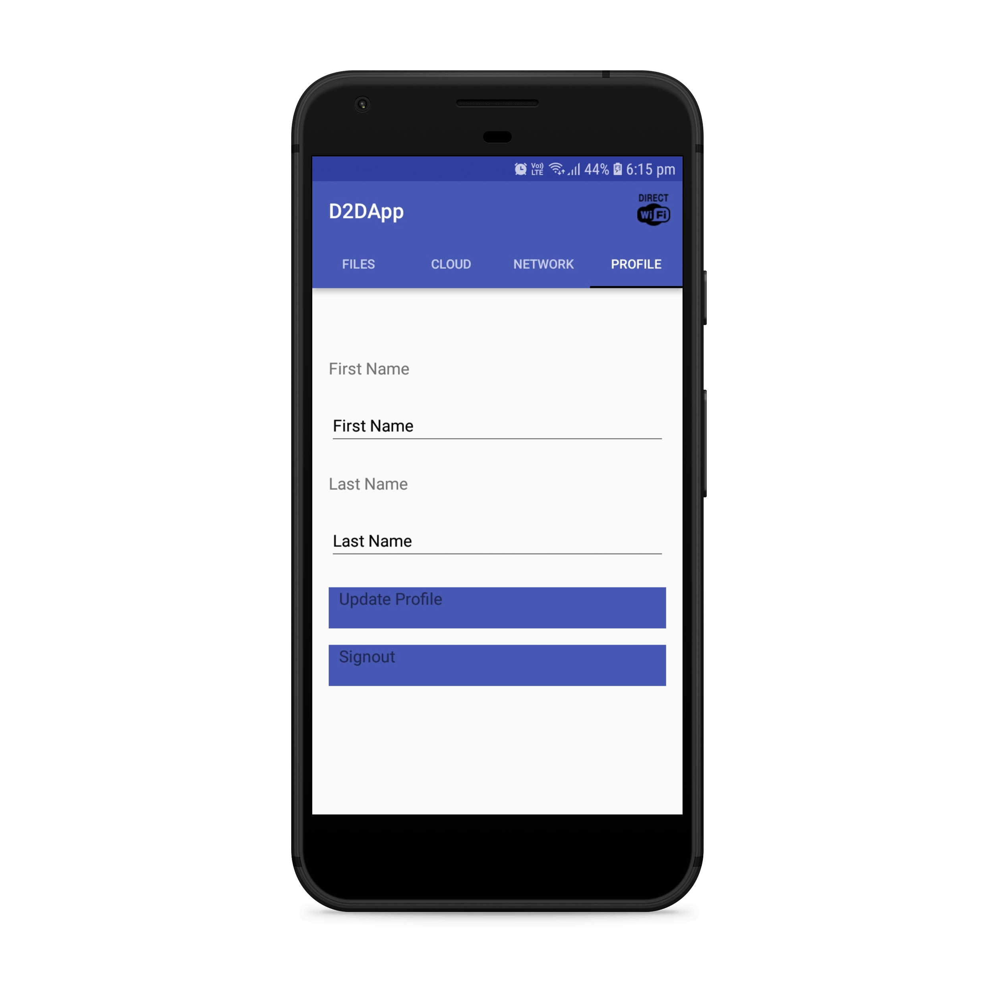
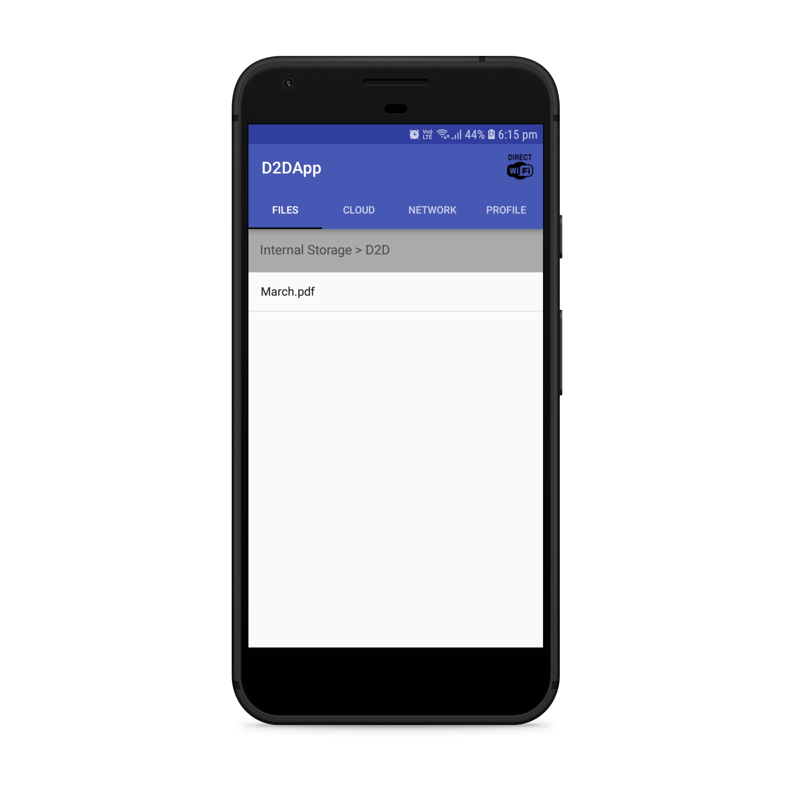
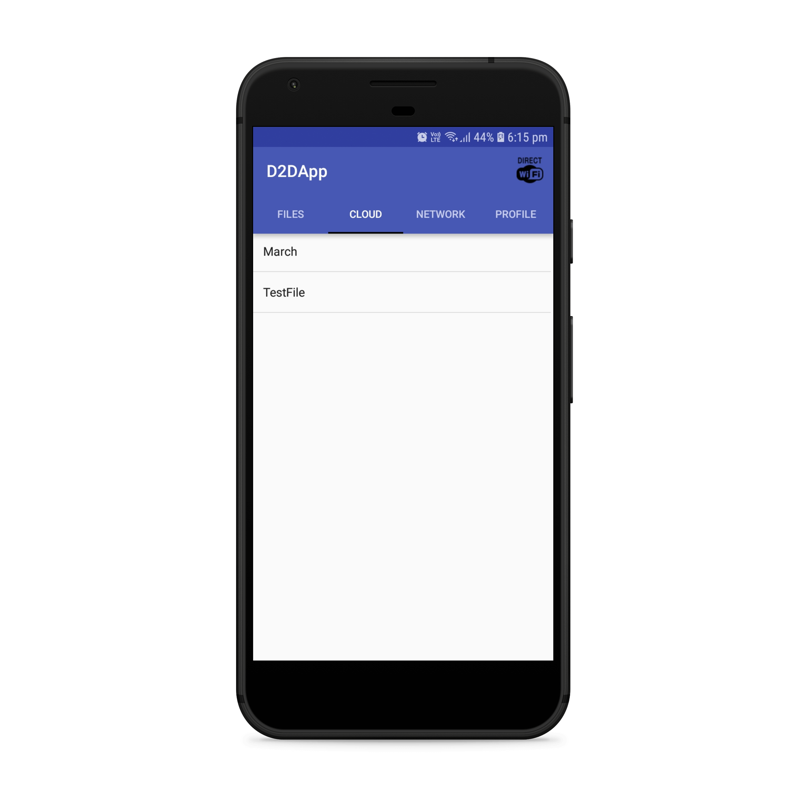
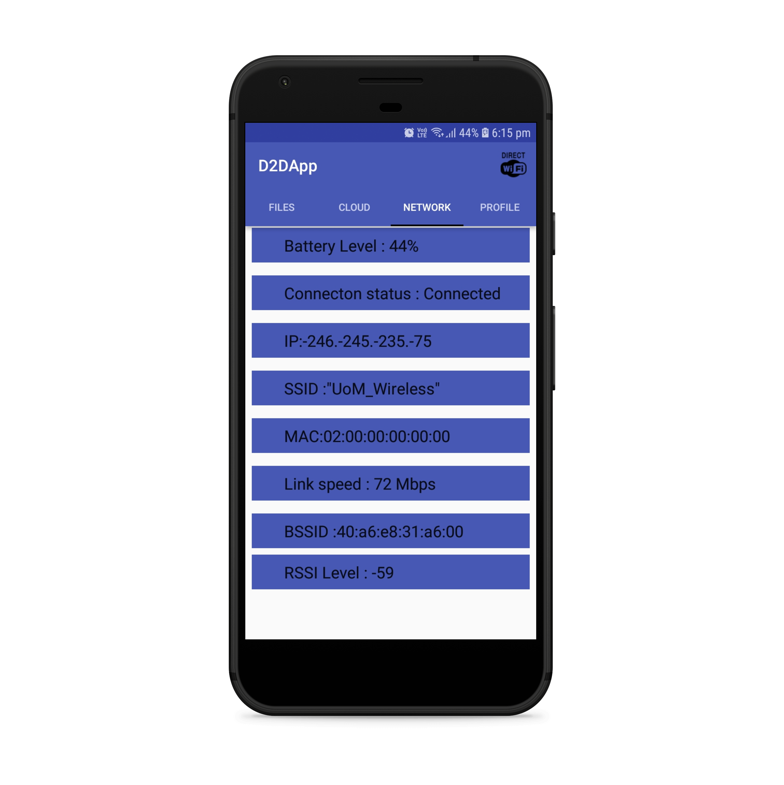

# C-RAN based D2D Android Application

## Description

We are trying to offload internet traffic to edge network using C-RAN based D2D communication. This application is developed to enable basic features of the system

We are focusing on following features

* Wifi Direct - D2D communication link

* Network detail extractions

* Use of REST APIs 

* Firebase Authentication

* Firebase Realtime Database

* Firebase Cloud Funtions for triggering events

* Firebase Messaging for invoking paired client applications

* Firebase Storage Buckets

## System Architecture

Following is the proposed system architecture for working with our application. Raise an issue if you have any Q's.

## Screens

# How to set up environment?

1. First clone this repository.

2. Add google-services.json (existing file is invalidated after the first phase) file downloaded from the firebase project.

3. Build using Gradle tool.

4. Remember to update API URLs with yours for testing 

## Authors

Isuru Nuwanthilaka

Lochana Chathura

## How to contribute?

Submit a pull request or raise 3 helpful issues to join D2DAPP Team!
